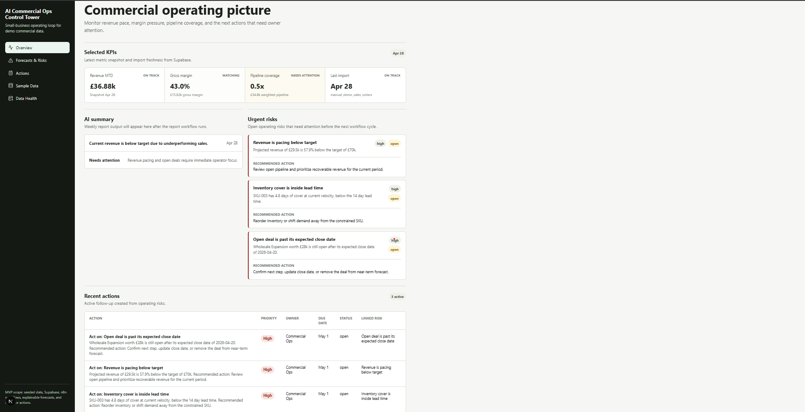
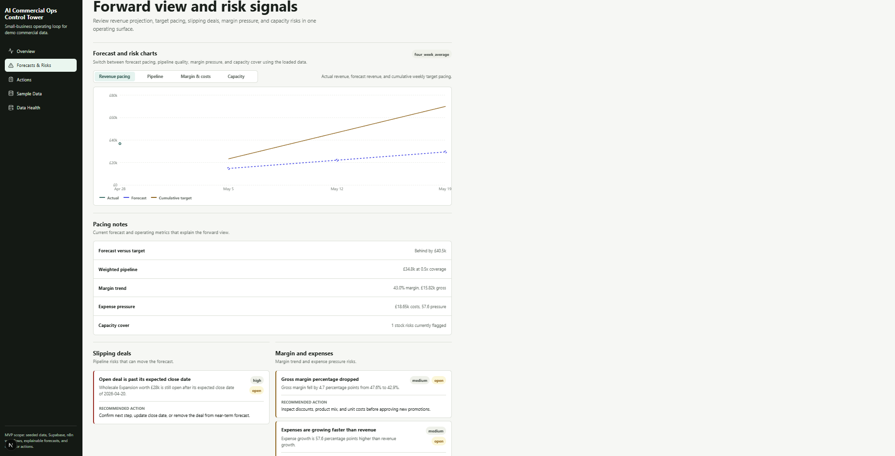
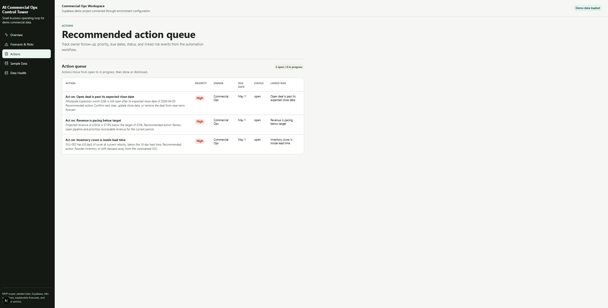
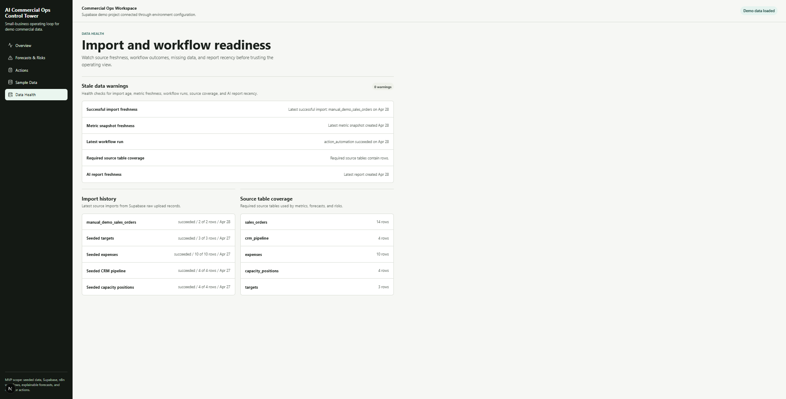

# AI Commercial Ops Control Tower

AI Commercial Ops Control Tower is a portfolio Next.js, Supabase, and n8n application for monitoring the commercial health of a small business. It turns seeded sales, pipeline, expense, capacity, and target data into KPI snapshots, revenue forecasts, risk signals, AI operating summaries, and recommended owner actions.

The project is designed as a public technical showcase: the data is safe demo data, the operating logic is explainable, and each dashboard view can be traced back to Supabase records and n8n workflow outputs.

## Why It Matters

Small teams often track revenue, pipeline, costs, inventory, and follow-up actions in separate tools. This project shows how those signals can be brought into one operating layer so a commercial operator can answer:

- Are we pacing toward revenue target?
- Is margin or cash pressure getting worse?
- Which open deals or capacity constraints put the forecast at risk?
- What actions should owners take next?
- Is the underlying data fresh enough to trust?

The application favors deterministic business rules and transparent workflow logs over opaque recommendations. Charts, KPIs, risks, and actions are derived from Supabase/demo data; the frontend does not invent records.

## Product Surface

| Route | Purpose |
| --- | --- |
| `/dashboard` | KPI overview, AI report summary, urgent risks, and recent recommended actions. |
| `/forecasts-risks` | Revenue pacing, pipeline, margin/cost, and capacity charts with risk sections for slipping deals, margin/expense pressure, and stock/capacity constraints. |
| `/actions` | Recommended action queue with owner, priority, status, due dates, and linked risk context. |
| `/data-health` | Import status, source table coverage, workflow/report readiness, and freshness checks. |
| `/sample-data` | Read-only view of the seeded source records that drive the operating pages. |

## Core Capabilities

- Commercial KPI monitoring for revenue, gross margin, operating costs, net contribution, average order value, sales velocity, weighted pipeline, pipeline coverage, stock risk count, and cash pressure.
- Revenue forecasting based on recent observed revenue, with target comparison and forecast bands.
- Risk detection for revenue pacing, margin drop, expense pressure, stockout/capacity risk, and deal slippage.
- AI weekly report generation from structured operating data, with JSON validation before saving the report.
- Recommended action creation from high-severity risks, including owner, priority, due date, and linked risk context.
- Data health checks so reviewers can see whether imports, workflow logs, source tables, metric snapshots, and AI reports are current.

## Architecture

```text
Seeded CSV / SQL demo data
  -> Supabase source tables
  -> n8n ingestion, metrics, forecast/risk, AI report, and action workflows
  -> Supabase output tables
  -> lib/supabase query helpers
  -> lib/metrics TypeScript transforms
  -> Next.js App Router dashboard pages
  -> Recharts visualizations and operator tables
```

### Stack

- **Next.js App Router**: server-rendered dashboard routes under `app/`.
- **Supabase Postgres**: source tables, generated output tables, demo read policies, and seeded operating data.
- **n8n automation workflows**: version-controlled workflow files that ingest, calculate, forecast, report, and create actions.
- **TypeScript transform layer**: `lib/metrics` normalizes Supabase rows into UI models, KPI tiles, chart series, and health checks.
- **Recharts**: charting for revenue pacing, pipeline quality, margin/cost movement, and capacity risk.

## Data Model

The Supabase schema includes source tables for demo operating records:

- `sales_orders`
- `crm_pipeline`
- `expenses`
- `capacity_positions`
- `targets`
- `raw_uploads`

Workflow output tables drive the app experience:

- `metric_snapshots`
- `forecasts`
- `risk_events`
- `ai_reports`
- `recommended_actions`
- `action_log`

Seed files live under `supabase/seed/`, and the initial schema is in `supabase/migrations/001_initial_schema.sql`.

## n8n Workflows

The automation layer is implemented with n8n and stored under `workflows/` so the orchestration logic can be reviewed alongside the application code. It covers ingestion, KPI generation, forecast/risk detection, AI reporting, and recommended action creation.

| Workflow | Trigger / source | Purpose | Output / effect |
| --- | --- | --- | --- |
| Commercial Ops Ingestion | POST webhook plus manual demo trigger | Validates and cleans incoming sales order payloads. | Inserts `sales_orders`, writes `raw_uploads`, and logs ingestion results to `action_log`. |
| Commercial Ops Daily Metrics | Daily schedule plus manual demo trigger | Queries clean operating tables and calculates the latest KPI snapshot. | Inserts a row into `metric_snapshots` and logs the run. |
| Commercial Ops Forecast and Risk | Daily schedule plus manual demo trigger | Builds revenue forecasts and applies deterministic risk rules for pacing, margin, expenses, capacity, and deal slippage. | Inserts `forecasts`, upserts `risk_events`, and logs the result. |
| Commercial Ops Weekly AI Report | Weekly schedule plus manual demo trigger | Pulls structured metrics, forecasts, risks, and actions into an LLM report prompt, then validates the JSON response. | Saves `ai_reports`, optionally posts Slack text, and logs success or validation failure. |
| Commercial Ops Action Automation | Hourly schedule plus manual demo trigger | Finds high-severity open risks without existing follow-up and classifies them into owner actions. | Inserts `recommended_actions`, optionally sends a Slack alert, and logs created or skipped actions. |

## Demo Data Flow

1. Seeded records populate Supabase source tables for orders, CRM pipeline, expenses, capacity, and targets.
2. The ingestion workflow can add validated sales order payloads and record import history.
3. The daily metrics workflow aggregates source tables into `metric_snapshots`.
4. The forecast/risk workflow reads the latest commercial state and writes `forecasts` plus `risk_events`.
5. The action workflow converts high-severity risk events into recommended actions.
6. The weekly AI report workflow summarizes the structured outputs into `ai_reports`.
7. The Next.js app queries Supabase, normalizes rows through `lib/metrics`, and renders the dashboard pages.

## What Reviewers Should Look At

- `app/dashboard/page.tsx`, `app/forecasts-risks/page.tsx`, `app/actions/page.tsx`, `app/data-health/page.tsx`, and `app/sample-data/page.tsx` for the product surface.
- `lib/supabase/queries.ts` for normalized reads from Supabase.
- `lib/metrics/transforms.ts` for KPI, chart, risk, action, and health-check transformations.
- `components/charts/` for the Recharts visualizations.
- `supabase/migrations/001_initial_schema.sql` and `supabase/seed/` for the demo operating model.
- `workflows/local_5678_joshua_k/personal/*.workflow.ts` for the automation layer.
- `services/forecasting/forecast.py` for the reference forecasting service used by the forecasting concept.

## Local Setup

Install dependencies:

```powershell
npm install
```

Create a local `.env` from `.env.example` and provide public Supabase read settings for a demo project:

```powershell
NEXT_PUBLIC_SUPABASE_URL=<your-demo-project-url>
NEXT_PUBLIC_SUPABASE_ANON_KEY=<your-demo-anon-key>
```

Apply the schema and seed data to a Supabase project that contains only safe demo records:

```text
supabase/migrations/001_initial_schema.sql
supabase/seed/seed.sql
```

Run the dashboard:

```powershell
npm run dev
```

Build the app:

```powershell
npm run typecheck
npm run build
```

Run the focused Node tests:

```powershell
node --experimental-strip-types --test lib\metrics\transforms.test.mjs
node --experimental-strip-types --test lib\formatting\currency.test.mjs
node --experimental-strip-types --test lib\supabase\queries.test.mjs
```

## Screenshots

| Slot | Dashboard route | Capture |
| --- | --- | --- |
| Overview | `/dashboard` | KPI tiles, AI summary, urgent risks, and recent actions. |
| Forecasts & Risks | `/forecasts-risks` | Forecast/pacing chart plus risk sections for deals, margin/expenses, and capacity. |
| Actions | `/actions` | Action queue showing priority, owner, due date, status, and linked risk context. |
| Data Health | `/data-health` | Import history, source table coverage, stale data warnings, and workflow/report readiness. |

### Overview



### Forecasts & Risks



### Actions



### Data Health



The `/sample-data` route is intentionally not pictured here; the same demo records can be reviewed directly in `supabase/seed/`.

## Deployment Notes

- Deploy the Next.js dashboard to Vercel or another Node-compatible host.
- Use a hosted Supabase project seeded only with public-safe demo data.
- Run n8n locally or in a hosted workspace for demos.
- Keep private credentials in environment variables or n8n credentials, not in committed files.
- Use the Supabase anon key only for read-safe demo data exposed by the public dashboard.

## Roadmap

- Add live connectors for CRM, finance, commerce, payments, and spreadsheet sources.
- Add dashboard controls for acknowledging risks and updating action status.
- Expand audit history for workflow runs and action lifecycle changes.
- Add scenario modeling for revenue target changes, constrained inventory, and pipeline pull-forward.
- Add tenant-aware access controls if the app becomes a hosted multi-business product.
